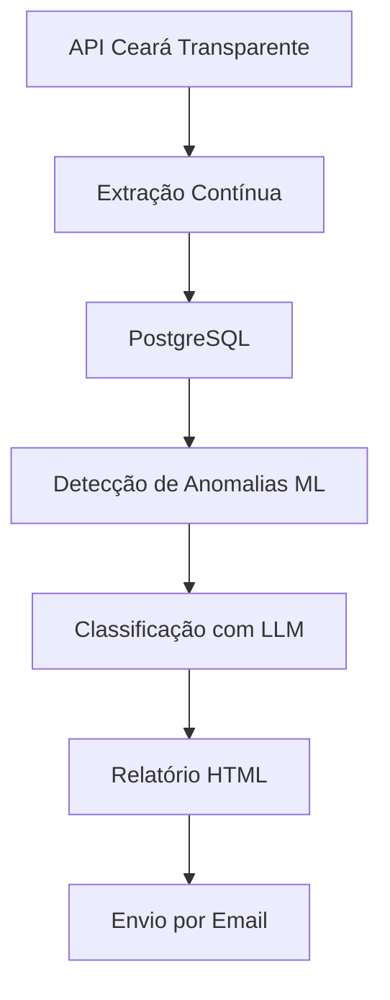

# 📊 Detecção de Anomalias em Contratos Públicos (Ceará Transparente)

  
  
  
  
  
  

---

## 🚀 Sobre o Projeto

Este projeto implementa um pipeline completo de dados para:

- 📥 Extração contínua de contratos públicos via API  
- 🧹 Tratamento e armazenamento estruturado  
- 🧠 Detecção de anomalias com Machine Learning  
- 🤖 Classificação inteligente com LLM  
- 📊 Geração automática de relatórios  

O objetivo é identificar **contratos potencialmente suspeitos** e transformar dados brutos em **insights acionáveis para auditoria pública**.

---

## 🏗️ Arquitetura do Pipeline

---

## 🔧 Tecnologias Utilizadas

### 🧱 Data Engineering
- Apache Airflow  
- Python (ETL)  
- PostgreSQL  
- Docker  

### 🧠 Machine Learning
- Isolation Forest  
- StandardScaler  
- Feature Engineering  

### 🤖 Inteligência Artificial
- OpenAI (LLM)  
- Classificação semântica de contratos  

### 📊 Visualização
- Relatório HTML automatizado  

---

## 📥 Fonte de Dados

Dados obtidos da API pública:

- Ceará Transparente  
- Contratos governamentais  

📌 **Período de coleta (dinâmico):**  
A coleta de dados considera uma janela móvel de **365 dias anteriores à execução da DAG**, garantindo atualização contínua e foco em dados recentes.

---

## 🧠 Detecção de Anomalias

Modelo utilizado:

IsolationForest

### Features:

- Valor global do contrato  
- Valor por dia  
- Prazo de vigência  

### Classificação de risco:

| Percentil | Nível |
|----------|------|
| ≥ 90     | 🔴 ALTO |
| ≥ 70     | 🟡 MÉDIO |
| < 70     | 🟢 BAIXO |

---

## 🤖 Classificação com LLM

Cada contrato anômalo é enriquecido com:

- 📌 Categoria (Saúde, Educação, TI...)  
- 🎯 Confiança (Alta, Média, Baixa)  
- ⚠️ Detecção de objeto vago  
- 🧾 Justificativa  
- ✍️ Resumo automático  

---

## 🗄️ Estrutura do Banco

- contratos  
- anomalias_contratos  
- anomalias_classificadas  

---

## 📊 Relatório Gerado

Inclui:

- Total de anomalias  
- Valor total suspeito  
- Distribuição por categoria  
- Órgãos com mais ocorrências  
- Níveis de risco  
- Objetos vagos detectados  

---

## 📧 Automação

✔ Execução automática via Airflow  
✔ Envio de relatório por email  

---

## ⚙️ Configuração

DB_HOST=host.docker.internal  
DB_PORT=5433  
DB_NAME=aula  
DB_USER=postgres  
DB_PASSWORD=1234  
OPENAI_API_KEY=your_key_here  

---

## ▶️ Execução

0 6 * * *  

---

## 👨‍💻 Autor

Carlos Arthur  

---

## 📌 Licença

Uso educacional.
